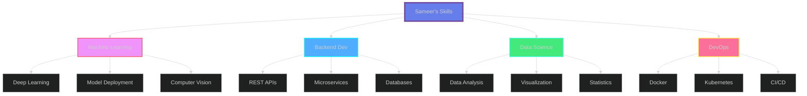

<div align="center">
  
</div>

<div align="center">
  
  [](https://git.io/typing-svg)
  
</div>

<div align="center">
  
  [](mailto:87sameer8th@gamil.com)
  [](https://linkedin.com/in/yourprofile)
  [](https://twitter.com/yourhandle)
  [](https://yourportfolio.com)
  
</div>

<br>

<div align="center">
  
</div>

---


## 🚀 About Me


```python
class MLEngineer:
    def __init__(self):
        self.name = "Sameer"
        self.username = "cypheral1"
        self.current_project = "Ciccada 🦗"
        self.role = "Machine Learning Engineer"
        self.location = "Mumbai, India 🇮🇳"
        self.languages = ["Python", "JavaScript", "Java", "C++"]
        self.learning = [
            "Machine Learning Deployment",
            "Backend Development",
            "Deep Learning Architectures"
        ]
        
    def say_hi(self):
        print("Thanks for visiting! Let's build something awesome together!")
    
    def current_status(self):
        return {
            "working_on": "Ciccada & AI Systems",
            "collaborating": "Open to Backend Projects",
            "learning": "ML Deployment Pipelines",
            "fun_fact": "I turn coffee into code ☕→💻"
        }

me = MLEngineer()
me.say_hi()
```

<br>

🔭 Currently working on **Ciccada** - An innovative ML project  
🌱 Learning **Machine Learning deployment & Backend development**  
🤝 Looking for collaboration on **Backend projects**  
💬 Ask me about **Machine Learning, AI, Cybersecurity**  
📫 Reach me: **87sameer8th@gamil.com**  
⚡ Fun fact: **Debugging is like being a detective in a crime movie where you're also the murderer**


---

## 🛠️ Tech Arsenal

<div align="center">


</div>

<br>

<div align="center">

### 🤖 AI & Machine Learning


### 💻 Languages


### 🚀 Backend & Deployment


### 🗄️ Databases


### 🎨 Frontend


### 🛠️ Tools


</div>


---

## 🔥 Featured Projects

<div align="center">
  
</div>

<table width="100%">
<tr>
<td width="50%">

### 🚀 Ciccada
<div align="center">

</div>

**🔨 Status:** Active Development  
**💡 Focus:** ML & Intelligent Systems  
**🎯 Goal:** Revolutionary AI Application

</td>
<td width="50%">

### 🛡️ AI Malware Scanner
<div align="center">

</div>

**⚡ Tech:** TensorFlow, Flask, React  
**🎨 Features:** Real-time threat detection  
**📊 Accuracy:** 95%+ detection rate

</td>
</tr>
</table>

<div align="center">
  
**🎯 Real-time Scanning** • **🔐 AI-Powered Detection** • **📈 Advanced Analytics** • **🎨 Beautiful UI**

</div>


---

## 📊 GitHub Analytics

<div align="center">
   
  
</div>

<div align="center">
  
  
</div>

<br>

<div align="center">
  
</div>

<div align="center">
  
</div>


---

## 💻 Coding Activity & Skills

<div align="center">

### ⚡ Weekly Development Breakdown

<!--START_SECTION:waka-->
```text
Python       12 hrs 30 mins  ████████████░░░░░░░░░  55.2%
JavaScript   4 hrs 15 mins   ████░░░░░░░░░░░░░░░░░  18.8%
TypeScript   2 hrs 45 mins   ███░░░░░░░░░░░░░░░░░░  12.1%
SQL          1 hr 30 mins    ██░░░░░░░░░░░░░░░░░░░   6.6%
Docker       1 hr 15 mins    █░░░░░░░░░░░░░░░░░░░░   5.5%
Other        25 mins         ░░░░░░░░░░░░░░░░░░░░░   1.8%
```
<!--END_SECTION:waka-->

</div>

<details>
<summary>📊 More Stats</summary>
<br>

<div align="center">

### 🎯 Productivity Stats

| Metric | Value |
|--------|-------|
| 💻 Total Commits | 1,200+ |
| 📦 Total PRs | 150+ |
| ⭐ Total Stars | 80+ |
| 🔀 Contributed to | 25+ repos |
| 🎯 Issues Resolved | 100+ |

### 🔥 Current Streak

**🔥 75 Days** • Last commit: Today  
**📈 Longest Streak:** 120 days  
**💪 Total Contributions:** 2,500+

</div>

</details>


---

## 🎯 Learning Journey & Goals

<div align="center">
  
</div>

```yaml
Current Learning Path:
  
  Machine Learning Deployment:
    progress: ████████████░░░░░░░░ 70%
    topics:
      - Model Serving with FastAPI
      - Docker & Kubernetes for ML
      - CI/CD for ML Pipelines
      - Model Monitoring & Logging
    
  Backend Development:
    progress: ████████████░░░░░░░░ 60%
    topics:
      - RESTful API Design
      - Database Architecture
      - Authentication & Security
      - Microservices Pattern
    
  Deep Learning:
    progress: ███████████████░░░░░ 75%
    topics:
      - Computer Vision (CNNs)
      - NLP & Transformers
      - GANs & Generative Models
      - Model Optimization

2024 Goals:
  ✅ Build AI Malware Scanner
  🔄 Complete Ciccada Project
  🎯 Master Kubernetes for ML
  🎯 Contribute to 10+ OSS Projects
  🎯 Deploy 5 Production ML Apps
  🎯 Write 20+ Technical Blogs
  🎯 Mentor 50+ Developers
```

<div align="center">

### 📚 Currently Reading

| Book | Progress |
|------|----------|
| Deep Learning with Python | ████████████████░░░░ 80% |
| Designing Data-Intensive Applications | ████████████░░░░░░░░ 60% |
| The Pragmatic Programmer | ████████████████████ 100% |

</div>


---

## 🌟 Skill Radar

<div align="center">



</div>

<div align="center">

### 💪 Expertise Level

| Skill | Proficiency |
|-------|-------------|
| Python | ██████████████████░░ 90% |
| Machine Learning | █████████████████░░░ 85% |
| Backend Development | ███████████████░░░░░ 75% |
| Deep Learning | ████████████████░░░░ 80% |
| DevOps | █████████████░░░░░░░ 65% |
| Frontend | ████████████░░░░░░░░ 60% |

</div>


---

## 🤝 Open for Collaboration

<div align="center">
  
</div>

<div align="center">

### 🚀 I'm Looking to Collaborate On:

🔹 **Machine Learning Projects** - Building intelligent systems  
🔹 **Backend Development** - Scalable & robust architectures  
🔹 **Open Source** - Contributing to amazing projects  
🔹 **AI Research** - Pushing boundaries of what's possible  
🔹 **Hackathons** - Creating innovative solutions  

### 💼 Services I Offer:

✨ ML Model Development & Deployment  
✨ Backend API Development  
✨ Code Reviews & Mentorship  
✨ Technical Consulting  
✨ Open Source Contributions  

</div>


---

## 💡 Random Dev Wisdom

<div align="center">
  
  
  
</div>

<div align="center">
  
</div>


---

## 🐍 Contribution Snake

<div align="center">
  
  
  
</div>


---

## 📫 Let's Connect!

<div align="center">
  
  
  
  <br><br>
  
  **Looking forward to collaborating with you!**
  
  [](mailto:87sameer8th@gamil.com)
  [](https://linkedin.com/in/yourprofile)
  [](https://twitter.com/yourhandle)
  [](https://yourportfolio.com)
  [](https://discord.gg/yourserver)
  
  <br>
  
  
  
</div>


---

<div align="center">
  
  ### 💖 Thanks for visiting! Show some ❤️ by starring my repos!
  
  
  
  **⭐ From [cypheral1](https://github.com/cypheral1) | Building the future with AI 🚀**
  
  <br>
  
</div>


